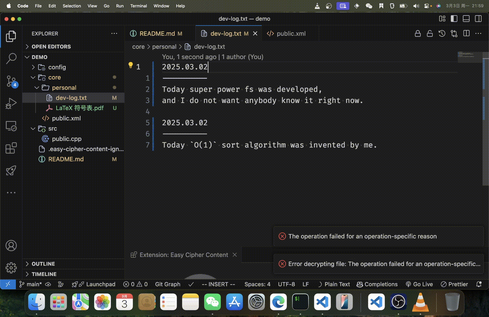
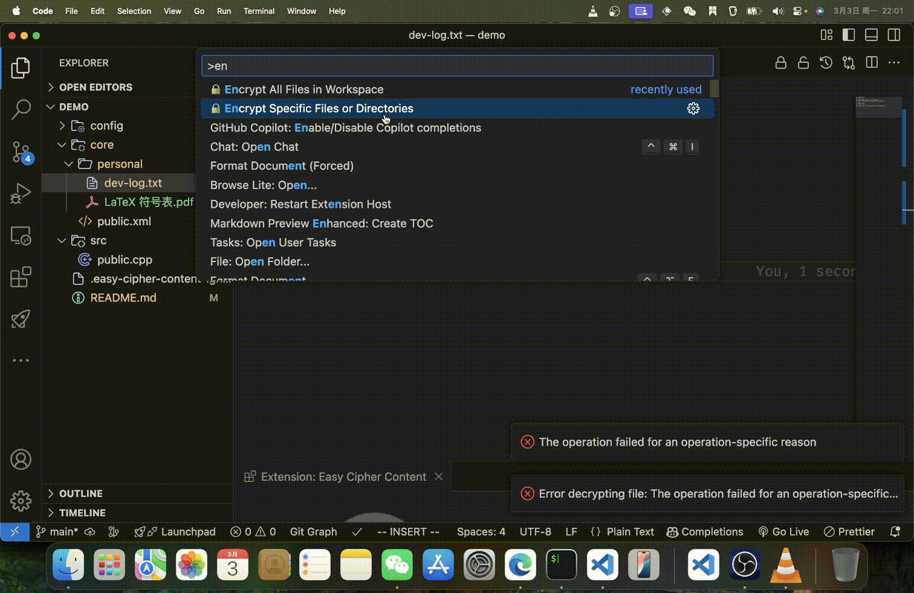

# Easy Cipher Content

A powerful VS Code extension for securing both text and binary files with industry-standard encryption algorithms. Easily protect your sensitive data while maintaining a seamless workflow in your development environment.



## Features

- 🔒 **Encrypt** and 🔓 **Decrypt** content with a single click
- 🔄 Support for both text files (line-by-line encryption) and binary files (complete file encryption)
- 🗄️ Batch operations for entire workspaces or specific directories
- 📂 Smart path suggestions and file browser integration
- 🚫 Configurable ignore patterns for excluding files from batch operations
- 🔐 Enterprise-grade encryption algorithms: AES-GCM and ChaCha20-Poly1305
- 🛠️ Flexible key management via environment variables or JSON configuration

## Getting Started

### Installation

1. Open VS Code
2. Go to Extensions (Ctrl+Shift+X / Cmd+Shift+X)
3. Search for "Easy Cipher Content"
4. Click Install

### Setup

Configure your encryption keys using one of these methods:

**Environment Variables** (Recommended for security)
```
# For AES-GCM
export VSCODE_EXT_ECC_AESGCM_PASSWORD="your-secure-password"
export VSCODE_EXT_ECC_AESGCM_SALT="your-salt-value"
export VSCODE_EXT_ECC_AESGCM_IV="your-initialization-vector"

# For ChaCha20-Poly1305
export VSCODE_EXT_ECC_CHACHA20POLY1305_PASSWORD="your-secure-password"
export VSCODE_EXT_ECC_CHACHA20POLY1305_SALT="your-salt-value"
export VSCODE_EXT_ECC_CHACHA20POLY1305_NONCE="your-nonce-value"
```

**JSON Configuration**
Create a JSON file with your encryption keys and set the path in the extension settings.

## Usage

### Single File Operations

1. Open a file in the editor
2. Click the 🔒 **Encrypt** or 🔓 **Decrypt** button in the editor title bar
3. For text files, content is encrypted line-by-line, preserving the file structure
4. For binary files, a new encrypted file is created with the `.enc` extension

### Workspace Operations

Encrypt or decrypt multiple files in your workspace:

1. Open the Command Palette (`Ctrl+Shift+P` / `Cmd+Shift+P`)
2. Type and select one of the following:
   - `Easy Cipher Content: 🔒 Encrypt All Files in Workspace`
   - `Easy Cipher Content: 🔓 Decrypt All Files in Workspace`
   - `Easy Cipher Content: 🔒 Encrypt Specific Files or Directories`
   - `Easy Cipher Content: 🔓 Decrypt Specific Files or Directories`

### Path Selection

When choosing specific files or directories to process, you have three convenient options:

1. **Quick Selection**: Choose from smart suggestions of common directories and files
2. **Custom Path**: Enter a custom path relative to your workspace or an absolute path
3. **File Browser**: Use the integrated file picker to visually select files or folders



### Ignoring Files and Directories

Create a `.easy-cipher-content-ignore` file in your workspace root with patterns similar to `.gitignore`:

```
# Example ignore patterns
node_modules/
*.log
.git/
dist/
```

## Extension Settings

This extension provides the following settings:

* `easy-cipher-content.algorithm`: Choose encryption algorithm ("aes-gcm" or "chacha20-poly1305")
* `easy-cipher-content.use_env`: Whether to use environment variables for encryption keys
* `easy-cipher-content.json_path`: Path to JSON file containing encryption keys (if not using env vars)
* `easy-cipher-content.textFileExtensions`: Array of file extensions to be treated as text files
* `easy-cipher-content.ignoreFile`: Name of the file containing ignore patterns
* `easy-cipher-content.deleteOriginalAfterEncryption`: Whether to delete original files after encryption

## Security Best Practices

- **Never commit** encryption keys or encrypted sensitive data to public repositories
- Use **environment variables** rather than JSON files for key management when possible
- Set up a secure method for sharing encryption keys with team members
- Consider using different keys for different projects or types of sensitive data

## Technical Details

### Text File Encryption

Text files are processed line by line, with each non-empty line encrypted individually. This approach:
- Preserves file structure and line breaks
- Makes diff tools still useful for encrypted files
- Allows partial decryption if only certain lines need to be accessible

### Binary File Encryption

Binary files are encrypted as complete units, resulting in a new file with the `.enc` extension.

## Known Issues

- Very large binary files may cause performance issues during encryption/decryption
- Some special encodings might not be preserved perfectly in text mode encryption
- The extension cannot automatically detect binary vs text files outside the configured extensions

## Troubleshooting

**Issue**: Decryption fails with "Invalid password" error
**Solution**: Verify that you're using the same encryption key that was used for encryption

**Issue**: Binary files are being treated as text files
**Solution**: Add the file extension to the `textFileExtensions` setting if it should be treated as text, or remove it if it should be treated as binary

## Contributing

Contributions are welcome! Please feel free to submit a Pull Request.

1. Fork the repository
2. Create your feature branch (`git checkout -b feature/amazing-feature`)
3. Commit your changes (`git commit -m 'Add some amazing feature'`)
4. Push to the branch (`git push origin feature/amazing-feature`)
5. Open a Pull Request

## License

Distributed under the MIT License. See `LICENSE` for more information.

## Acknowledgments

- Built with [easy-cipher-mate](https://github.com/PiperLiu/easy-cipher-mate) encryption library
- Inspired by the need for simple but secure content protection in VS Code

---

**Privacy Notice**: This extension performs all encryption and decryption locally on your machine. Your encryption keys and content are never transmitted to any server.